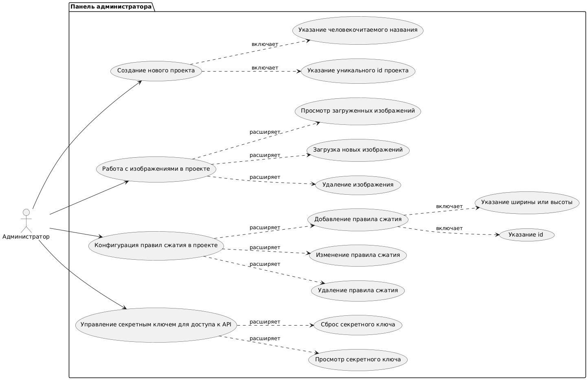
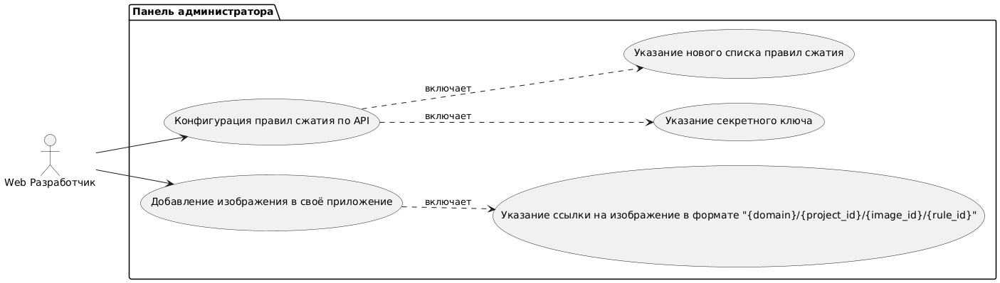

# 1. Перечень заинтересованных лиц
* **IT-компании:**  
  *Описание:* Целевая аудитория. Скорость загрузки их web-приложений влияет на вовлечённость пользователей и SEO сервиса. При этом у небольших компаний может не быть ресурсов для поддержания собственного сервиса для сжатия изображений. 
* **Пользователи**  
  *Описание:* Пользователи web-сервисов, созданных IT-компаниями, использующими сервис сжатия изображений. Взаимодействия с ними напрямую нет, но они тоже заинтересованы в продукте.

# 2. Перечень функциональных требований
* **Панель администратора:**  
  а. *Создание нового проекта:*   
    - Возможность указания человекочитаемого названия и id (оно будет указано в адресах изображений).

  б. *Ручная конфигурация правил сжатия:*  
    - Возможность добавить/удалить/изменить правило для сжатия.
    - Правило представляет из себя id и размер по ширине или высоте, также есть опциональная возможность добавить человекочитаемое название и описание.

  в. *Загрузка изображения в проект*
    - После загрузки администратор должен получить ссылку на новое изображения в оригинальном размере

  г. *Управление секретным ключем для доступа к API:*  
    - Просмотр и копирование секретного ключа.
    - Сброс и генерация нового секретного ключа.

  д. *Работа с загруженными изображениями:*  
    - Просмотр загруженных изображений и ссылок на них.
    - Удаление выбранного изображения (в этом случае удаляются все его копии в различных конфигурациях).
    
    
* **REST API для внешних приложений:**  
  а. *Возможность задать конфигурацию проекта через REST API endpoint:*  
    - Возможно только при наличии секретного ключа.


* **Сервер:**  
  а. *Хранит загруженные изображения в оригинальном размере, а также сжатым согласно конфигурации:*
    - Изображения хранятся по адресу следующего формата `{domain}/{project_id}/{image_id}/{rule_id}`, где `project_id` - id проекта, который указывает администратор на этапе создания проекта, где `image_id` - уникальный id изображения в проекте, который генерируется автоматически, `rule_id` - id правила, которое задаётся при создании правила.
    - Оригиналы изображений хранятся по адресам такого же формате, где `rule_id` равен `orig`.

  б. *При добавлении нового правила сжатия, добавляет новую версию всех загруженных изображений.*

  в. *При изменении правила сжатия, для всех изображений заменяет экземпляр для изменённого правила под новый формат.*
  
  г. *При удалении правила сжатия, для всех изображений удаляет экземпляр для удалённого правила.*
  

# 3. Диаграммы вариантов использования для функциональных требований  
## Диаграмма вариантов для функциональных требований панели администратора


Код:  
```PlantUML
@startuml

left to right direction

actor "Администратор" as act
package "Панель администратора" {
  usecase UC1 as "Создание нового проекта"
  usecase UC2 as "Работа с изображениями в проекте"
  usecase UC3 as "Конфигурация правил сжатия в проекте"
  usecase UC4 as "Управление секретным ключем для доступа к API"
  usecase UC5 as "Указание уникального id проекта"
  usecase UC6 as "Указание человекочитаемого названия"
  usecase UC7 as "Загрузка новых изображений"
  usecase UC8 as "Просмотр загруженных изображений"
  usecase UC9 as "Удаление изображения"
  usecase UC10 as "Изменение правила сжатия"
  usecase UC11 as "Добавление правила сжатия"
  usecase UC111 as "Указание id"
  usecase UC112 as "Указание ширины или высоты"
  usecase UC12 as "Удаление правила сжатия"
  usecase UC13 as "Просмотр секретного ключа"
  usecase UC14 as "Сброс секретного ключа"
}

act --> UC1
act --> UC2
act --> UC3
act --> UC4
UC1 ..> UC5: включает
UC1 ..> UC6: включает
UC2 ..> UC7: расширяет
UC2 ..> UC8: расширяет
UC2 ..> UC9: расширяет
UC3 ..> UC10: расширяет
UC3 ..> UC11: расширяет
UC11 ..> UC111: включает
UC11 ..> UC112: включает
UC3 ..> UC12: расширяет
UC4 ..> UC13: расширяет
UC4 ..> UC14: расширяет

@enduml
```

## Диаграмма прецедентов для функциональных требований использования сервиса от лица разработчика
  

Код:  
```PlantUML
@startuml

left to right direction

actor "Web Разработчик" as act
package "Панель администратора" {
  usecase UC1 as "Конфигурация правил сжатия по API"
  usecase UC11 as "Указание нового списка правил сжатия"
  usecase UC12 as "Указание секретного ключа"
  usecase UC2 as "Добавление изображения в своё приложение"
  usecase UC21 as "Указание ссылки на изображение в формате "{domain}/{project_id}/{image_id}/{rule_id}""
}

act --> UC1
act --> UC2
UC1 ..> UC11: включает
UC1 ..> UC12: включает
UC2 ..> UC21: включает

@enduml
```

# 4. Перечень сделанных предположений  
* **Технические предположения:**  
  - Так как API для автоматической конфигурации представляет из себя всего 1 endpoint, можно не выделять его в отдельный сервис.  
  - Теоритически сервис уязвим для ddos атак, так как внесение изменений в конфигурации сжатия - долгая операция. Возможно,
стоит добавить ограничение на количество запросов от пользователя на период времени.
  - Так как операции добавления новых правил требуют долгой обработки всех изображений, возможно, стоит
сделать эту операцию асинхронной. Но перед принятием этого решения нужно понять,
насколько долгой на самом деле будет операция.
* **Бизнес-предположения:**  
  - IT-компании заинтересованы в уменьшении скорости загрузки приложения, но у них не всегда есть много ресурсов разработки на оптимизацию.

# 5. Перечень нефункциональных требований  
* **Безопасность:**  
  - Аутентификация и авторизация в панели администратора должны быть реализованы с использованием современных стандартов безопасности.  
* **Надежность:**  
   - Загруженные изображения не должны быть утеряны.  
* **Скорость:**  
   - Раздача изображений происходит без необходимости дополнительной обработки запроса.