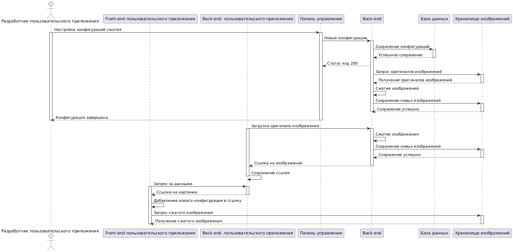
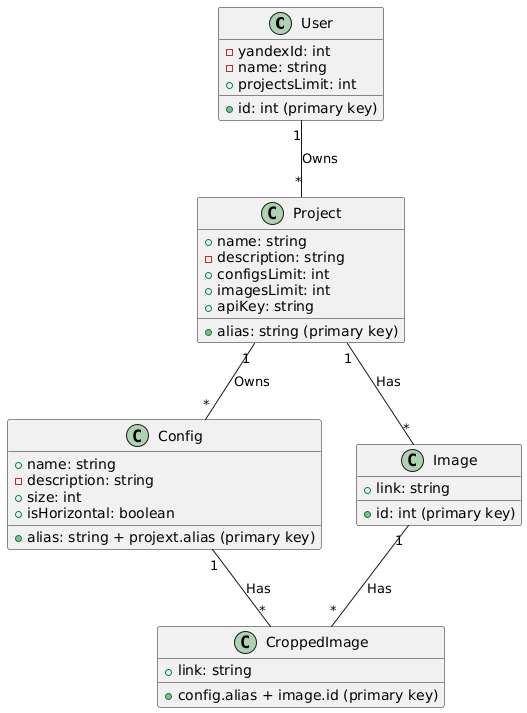

# 1. C4 Model
Диаграммы по C4 представлены во 2 лабораторной работе

# 2. Диаграмма последовательностей

# 3. Схема БД

1. **`User` (Пользователь):**
   - Учетная запись.
   - Id аккаунта Яндекс, через API которого будет доступна авторизация.
Значение уникальное для каждого пользователя, но не является первичным ключем и обязательным, так как
в будущем возможно добавление других способов авторизации.
   - Ограничение на количество проектов, которыми он может владеть.
2. **`Project` (Проект):** 
   - Название проекта.
   - Описание проекта.
   - Ограничение на количество конфигураций в проекте.
   - Ограничение на количество изображений в проекте.
   - Ключ для работы с проектом по API.
3. **`Config` (Конфигурация):**
   - Уникальный для проекта алиас.
   - Человекочитаемое название.
   - Описание.
   - Размер, до которого нужно сжать изображение (в пикселях).
   - Ориентация для сжатия.
4. **`Image` (Изображение):**
   - Ссылка на файл
5. **`CroppedImage` (Сжатое изображение):**
   - Ссылка на файл

# 4. Принципы разработки
Рассмотрим на примере моего пет-проекта conveys:  
[Front-end](https://github.com/LightScrool/conveys_client)  
[Back-end](https://github.com/LightScrool/conveys_server)

## KISS
[Маршрутизатор](https://github.com/LightScrool/conveys_server/blob/master/routes/surveysRouter.js)
организован как объект, у которого вызываются методы, названные как методы http
запроса, в которые передаются адрес энд поинта и функция для обработки запроса.  
Это скрывает сложность внутренней реализации и позволяет сфокусирование внимание на самом главном -
маршрутах и методах.

## YAGNI
Реализован только необходимый функционал, неиспользуемые утилиты, компоненты и эндпоины отсутствуют. 

## DRY
Использован компонентный подход, благодаря которому для одинаковых частей интерфейса
не нужно дублировать код.  
Например, компонент [PageContainer](https://github.com/search?q=repo%3ALightScrool%2Fconveys_client%20PageContainer&type=code)
используется на большинстве страниц, чтобы задать нужные отступы и позиционирование контента.

## SOLID

 * `S`: Компоненты имеют одну основную ответственность. В случае, если правило нарушалось, компонент разделялся на несколько.
 * `O`: Каждый модуль экспортирует только то, что нужно внешним модулям для его использования. Детали реализации скрыты внутри.
 * `L`: Наследование не используется, так как разработка на JS или TS редко подразумевает использование ООП. 
 * `I`: Все интерфейсы и типы содержат лишь необходимые методы и поля.
 * `D`: Соблюдается благодаря использованию React и Virtual DOM.

# 5. Применимость принципов для продукта

## BDUF - Big design up front (Масштабное проектирование прежде всего)

**Описание:**  
BDUF может быть полезным в случаях, когда требования к проекту хорошо определены и
изменения маловероятны. Это позволяет учесть все детали проектирования на ранних этапах и избежать
больших изменений в ходе разработки.

В современной среде разработки, где требования могут меняться, гибкие методологии более
предпочтительны. BDUF может быть избыточным и затруднить адаптацию к изменениям, особенно в долгосрочных
проектах.

**Применимость в проекте:**  
Так как на данный момент нет уверенности в том, что проект "взлетит" и его нужно будет масштабировать,
этот принцип не совсем подходит. При этом соблюдение SoC позволит при необходимости масштабировать отдельные
компоненты системы.

## SoC - Separation оf concerns (Принцип разделения ответственности)

**Описание:**  
Принцип SoC содействует легкости поддержки, повторному использованию кода и тестированию.
Разделение кода на логические компоненты с определенными обязанностями облегчает понимание кода и его
модификацию.

В некоторых случаях (например, в простых проектах) чрезмерное разделение может привести
к избыточности кода и усложнению проекта без необходимости.

**Применимость в проекте:**  
Сервис разделён на front-end, back-end, s3 и базу данных. Есть вероятность,
что в будущем хранилище изображений будет заменено на более мощную распределённую систему,
а благодаря SoC, такой переход будет более безболезненным.

## MVP - Minimum viable product (Минимально жизнеспособный продукт)

**Описание:**  
Использование MVP позволяет быстро внедрить базовую функциональность продукта и получить
обратную связь. Это позволяет лучше понять требования и улучшить продукт на ранних этапах.

**Применимость в проекте:**  
Хорошо подходит из-за ограниченности времени (проект привязан к графику учебного процесса),
поэтому будет применён.

## PoC - Proof of concept (Доказательство концепции)

**Описание:**  
PoC полезен, когда необходимо оценить техническую осуществимость или
эффективность конкретной концепции перед тем, как начинать полноценную разработку.

В некоторых ситуациях (например, когда требования к проекту хорошо известны) PoC
может быть избыточным, и разработку стоит начинать сразу с основного проекта.

**Применимость в проекте:**  
Уменьшение размера изображений до такого, который отображается на странице - это
частая практика в современной веб разработке и её эффективность доказана. Поэтому тратить ресурсы на PoC нет
необходимости