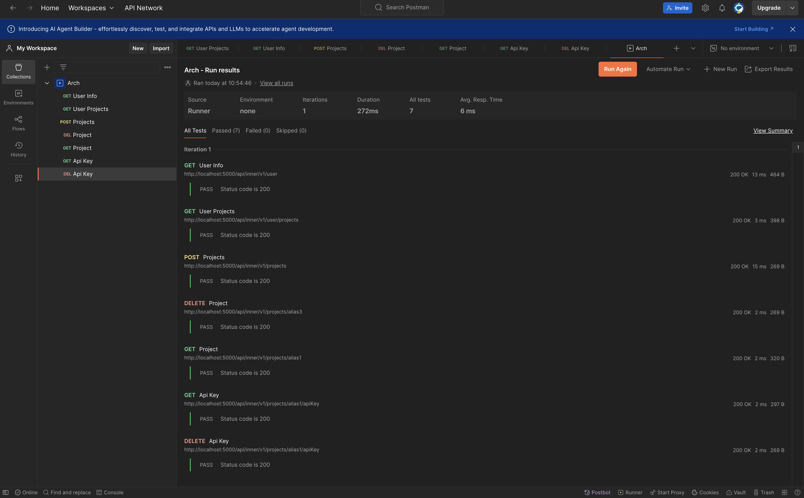

# Проектирование API

## Общие типы
```ts
type Preset = {
    alias: string;
    name: string;
    description?: string;
    size: int;
    isHorizontal: boolean;
}
```


## Список внутренних эндпоинтов

### Получение информации о пользователе
method: `GET`

path: `/api/inner/v1/user`

response:
```ts
type Response = {
    name: string;
    avatar?: url;
}
```

errors:
```
401 - пользователь не авторизован
500 - непредвиденная ошибка
```

### Получение списка проектов пользователя
method: `GET`

path: `/api/inner/v1/user/projects`

response:
```ts
type Response = Array<{
    alias: string;
    name: string;
    description?: string;
}>
```

errors:
```
401 - пользователь не авторизован
500 - непредвиденная ошибка
```

### Создание проекта
method: `POST`

path: `/api/inner/v1/projects`  

request:
```ts
type Body = {
    alias: string;
    name: string;
    description?: string;
}
```

response: `ok`

errors:
```
400 - несоответствие контракту
400 - alias занят
401 - пользователь не авторизован
403 - превышен лимит проектов
500 - непредвиденная ошибка
```

### Удаление проекта
method: `DELETE`

path: `/api/inner/v1/projects/{projectAlias}`  

request:
```ts
type Path = {
    projectAlias: string;
}
```

response: `ok`

errors:
```
401 - пользователь не авторизован
403 - проект не принадлежит пользователю
404 - проект не найден
500 - непредвиденная ошибка
```

### Получение информации о проекте
method: `GET`

path: `/api/inner/v1/projects/{projectAlias}`

request:
```ts
type Path = {
    projectAlias: string;
}
```

response:
```ts
type Response = {
    name: string;
    description?: string;
    presets: Array<Preset>
}
```

errors:
```
401 - пользователь не авторизован
403 - проект не принадлежит пользователю
404 - проект не найден
500 - непредвиденная ошибка
```

### Получение ключа для доступа к проекту по API 
method: `GET`

path: `/api/inner/v1/projects/{projectAlias}/apiKey`

request:
```ts
type Path = {
    projectAlias: string;
}
```

response:
```ts
type Response = {
    apiKey: string;
}
```

errors:
```
401 - пользователь не авторизован
403 - проект не принадлежит пользователю
404 - проект не найден
500 - непредвиденная ошибка
```

### Сброс ключа для доступа к проекту по API
method: `DELETE`

path: `/api/inner/v1/projects/{projectAlias}/apiKey`

request:
```ts
type Path = {
    projectAlias: string;
}
```

response: `ok`

errors:
```
401 - пользователь не авторизован
403 - проект не принадлежит пользователю
404 - проект не найден
500 - непредвиденная ошибка
```

### Получение списка изображений проекта
method: `GET`

path: `/api/inner/v1/projects/{projectAlias}/images`

request:
```ts
type Path = {
    projectAlias: string;
}
```

response:
```ts
type Response = Array<{
   id: string;
   name?: string;
   description?: string;
   url: string;
}>
```

errors:
```
401 - пользователь не авторизован
403 - проект не принадлежит пользователю
404 - проект не найден
500 - непредвиденная ошибка
```

### Загрузка изображения
TODO

### Удаление изображения
method: `DELETE`

path: `/api/inner/v1/projects/{projectAlias}/images/{imageId}`

request:
```ts
type Path = {
    projectAlias: string;
    imageId: string;
}
```

response: `ok`

errors:
```
401 - пользователь не авторизован
403 - проект не принадлежит пользователю
404 - проект/изображение не найдены
500 - непредвиденная ошибка
```

### Обновление конфигураций проекта
method: `POST`

path: `/api/inner/v1/projects/{projectAlias}/presets`

request:
```ts
type Path = {
    projectAlias: string;
}

type Body = Array<Preset>
```

response: `ok`

errors:
```
400 - ошибка валидации пресетов
401 - пользователь не авторизован
403 - проект не принадлежит пользователю
404 - проект не найден
500 - непредвиденная ошибка
```


## Список внешних эндпоинтов

### Загрузка изображения
TODO

### Удаление изображения
method: `DELETE`

path: `/api/outer/v1/projects/{projectAlias}/images/{imageId}`

request:
```ts
type Path = {
    projectAlias: string;
    imageId: string;
}
```

response: `ok`

errors:
```
401 - отсутствует авторизационный токен
403 - авторизационный токен невалиден
404 - проект/изображение не найдены
500 - непредвиденная ошибка
```

### Обновление конфигураций проекта
method: `POST`

path: `/api/outer/v1/projects/{projectAlias}/presets`

request:
```ts
type Path = {
    projectAlias: string;
}

type Body = Array<Preset>
```

response: `ok`

errors:
```
400 - ошибка валидации пресетов
401 - отсутствует авторизационный токен
403 - авторизационный токен невалиден
404 - проект не найден
500 - непредвиденная ошибка
```

# Проектирование API

Спроектированное API было частично реализовано, исходный код находится в папке `src/server`

# Postman

Запросы были проверены с помощью postman вручную, а также были реализованы
тесты на статус коды.


